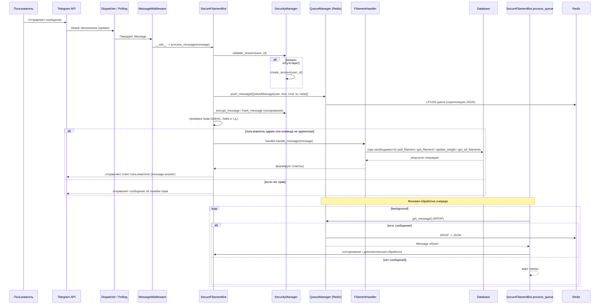

# Filament Tracker Bot

Телеграм бот для отслеживания количества оставшегося пластика в катушках для 3D-принтера. Бот позволяет вести учет нескольких катушек, отслеживать их текущий вес и процент оставшегося материала.

## Возможности

- Добавление новых катушек с пластиком
- Просмотр списка всех катушек
- Обновление веса катушки
- Автоматический расчет процента оставшегося пластика
- Хранение информации о материале, цвете и весе

## Технологии

- Python 3.8+
- aiogram 3.2.0
- aiosqlite
- SQLite

## Установка

1. Клонируйте репозиторий:
```bash
git clone https://github.com/DalekTek/Filament-tracker.git
cd filament_tracker_bot
```

2. Создайте виртуальное окружение и активируйте его:
```bash
python -m venv venv
# Для Windows:
venv\Scripts\activate
# Для Linux/Mac:
source venv/bin/activate
```

3. Установите зависимости:
```bash
pip install -r requirements.txt
```

4. Создайте файл .env и настройте его:
```bash
BOT_TOKEN=your_bot_token_here
DATABASE_PATH=filament.db
```

5. Инициализируйте базу данных:
```bash
# Для Windows:
init_db.bat
# Для Linux/Mac:
./init_db.sh
```

## Запуск

```bash
python bot.py
```

## Использование

Бот поддерживает следующие команды:

- `/start` - Начало работы с ботом
- `/help` - Показать список доступных команд
- `/add` - Добавить новую катушку
- `/list` - Показать список всех катушек
- `/update <id>` - Обновить вес катушки

### Пример добавления новой катушки:

1. Отправьте команду `/add`
2. Следуйте инструкциям бота:
   - Введите название катушки
   - Укажите тип материала (PLA, PETG, ABS и т.д.)
   - Введите начальный вес в граммах
   - Укажите цвет пластика

## Структура проекта

```
filament_tracker_bot/
├── bot.py              # Основной файл бота
├── config.py           # Конфигурация
├── database.py         # Работа с базой данных
├── handlers.py         # Обработчики команд
├── models.py           # Модели данных
├── requirements.txt    # Зависимости
├── .env               # Конфигурационные переменные
└── README.md          # Документация
```

## Подробности реализации

### Слушатели команд

Слушатель сообщений реализован в нескольких местах:
 - **Telegram-приёмник**: в `bot.py` — метод `SecureFilamentBot.start()` запускает цикл приёма через 
   `dp.start_polling(...)`. Это главный "listener" для входящих апдейтов. 
 - **Middleware**: в `bot.py` — `MessageMiddleware` (подключается через `self.dp.message.middleware(...)`) перехватывает 
   и передаёт сообщения в `SecureFilamentBot.process_message`. 
 - **Обработчики команд**: в `handlers.py` — класс `FilamentHandler` и его метод `register_handlers` регистрируют 
   конкретные хэндлеры для сообщений. 
 - **Очередь сообщений**: фоновая задача в `bot.py` — `process_queue` (создаётся через `asyncio.create_task`) 
   читает из очереди через `queue_manager.py` и служит слушателем для сообщений в Redis.

Входящие Telegram‑сообщения ловит `polling` в `bot.py` (с промежуточной обработкой в `MessageMiddleware`), 
а обработку фоновых/очередных сообщений делает `process_queue` через `queue_manager.py`.




## Разработка

Проект использует:
- ООП для организации кода
- Паттерн Repository для работы с базой данных
- Паттерн State для управления состояниями
- Асинхронное программирование
- Type hints для улучшения читаемости кода

## Лицензия

MIT